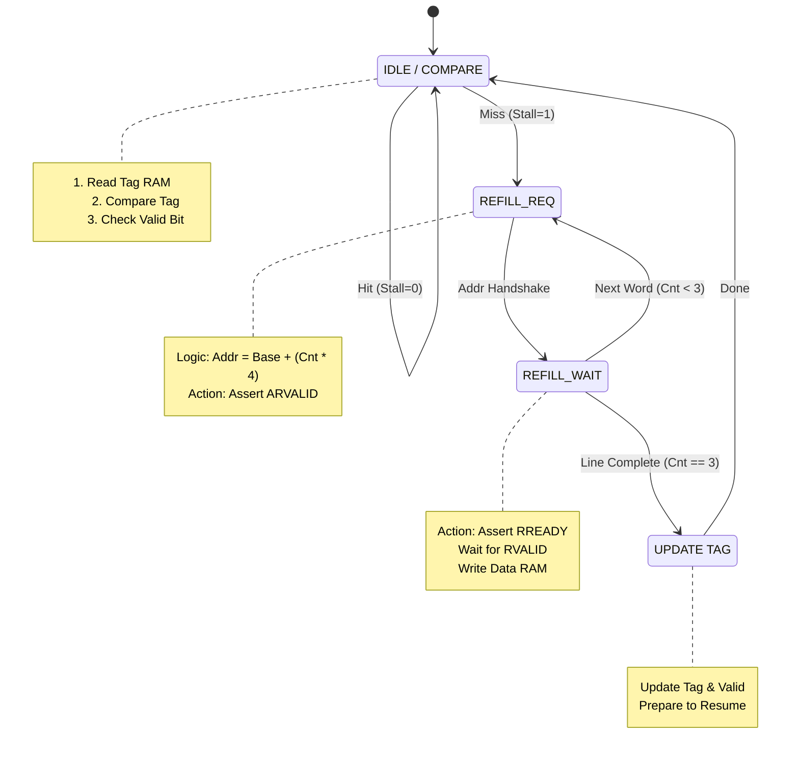
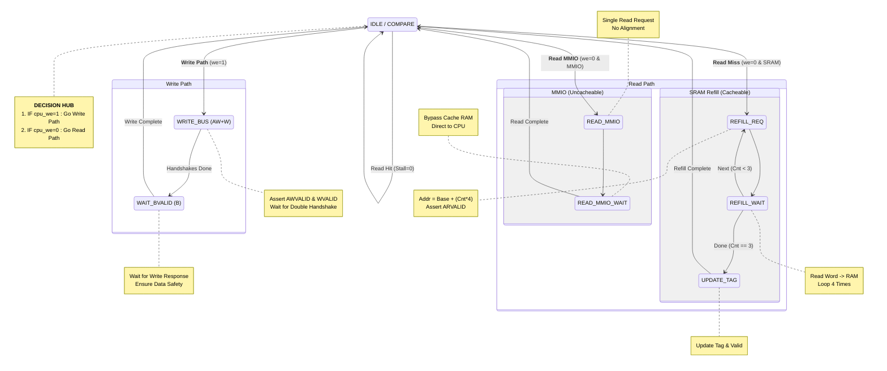

# Implement cache for MyCPU
> 徐曉汎, 陳婕寧

## Goals
* The provided pipelined RISC-V design (`4-soc`) already supports AXI4-Lite. In this project, you must continue using AXI4-Lite while adding a cache, even though this introduces several engineering constraints.
* Because AXI4-Lite forbids burst transactions, the cache controller cannot request multiple words in a single transfer. It must request each word individually. The main engineering challenge is designing a refill state machine that behaves as a sequencer.
* Cache design works on cache lines (for example, 16 or 32 bytes), while AXI4-Lite operates only on single 4-byte words. When a cache miss occurs, the controller must not issue just one address; instead, it must perform a sequence of word loads:
  1. Cycle A: Send address X (word 0), wait for handshake, store into cache RAM index 0.
  2. Cycle B: Send address X+4 (word 1), wait for handshake, store into index 1.
  3. Repeat until the entire cache line is filled.
* This design requires a counter inside the FSM and logic to increment the address (Addr_next = Addr_current + 4). Although slower than AXI4 burst transfers, this approach is easier to debug and is compatible with AXI4-Lite.
* Because AXI4-Lite is used, cache parameters must be tuned carefully to avoid excessive CPU stalling.
* Line size should be kept small. A typical 64-byte cache line (16 words) would require 16 separate AXI address handshakes, creating a large miss penalty.
  Recommendation: Use a 16-byte cache line (4 words). This provides spatial locality (e.g., fetching the next few instructions) without stalling the pipeline excessively.
* Instruction cache (I-cache) behavior:
  * On a miss, stall the pipeline.
  * The FSM asserts ARVALID for the base address of the line.
  * It loops four times (for a 4-word line), capturing each returned word.
  * After all words are fetched, update the tag and valid bit, then release the stall.
  * Since instructions are read-only, no read-modify-write sequence is needed.
* Data cache (D-cache) behavior:
  * Avoid implementing write-back with AXI4-Lite. Evicting a dirty line would require four separate write transactions before reading the new line, dramatically increasing FSM complexity (managing BVALID multiple times, then ARVALID cycles).
  * Instead, implement write-through, which aligns cleanly with AXI4-Lite semantics.
* AXI4-Lite provides the WSTRB (write strobe) signal, which must be handled correctly:
  * For an `sb` (store byte) instruction, only 8 bits are written.
  * The cache must update only those bits within the data-cache SRAM.
  * The bus interface must assert the correct WSTRB value (for example, 0001 or 0010) so that the main memory updates only the targeted byte.
  * Incorrect mapping of byte/halfword offsets to WSTRB is a common source of bugs.
* Using AXI4-Lite simplifies the bus protocol (no bursts, no RLAST, no AxLEN) but results in lower performance and forces a more chatty refill process.
* Strategy: Implement a direct-mapped, write-through cache with a 16-byte line size. This is the most practical design choice. It provides hands-on experience with tag comparison, miss handling, and pipeline stalling, without requiring the significant added complexity of supporting write-back over a non-burst interface.

---

## AXI4-Lite
The central engineering challenge of this project lies in the integration of a cache memory system within a strictly defined AXI4-Lite bus architecture. While standard high-performance cache controllers rely on AXI4 Burst transactions to fetch entire cache lines in a single handshake, AXI4-Lite is inherently limited to single-word transfers.

This protocol limitation creates a mismatch between the cache's requirement for spatial locality and the bus's capability. Consequently, the standard approach of issuing a single base address to refill a cache line is impossible.

### Analysis of Differences: AXI4 bus vs. AXI4-Lite Protocol
The AXI4 protocol is a cornerstone of the ARM AMBA specification, engineered for high-bandwidth and high-performance system interconnects. 

To accommodate varying resource constraints, the specification defines two primary variants: the full-featured **AXI4 bus** and the lightweight **AXI4-Lite**. The architectural divergences between these two protocols fundamentally dictate the design strategy for the Cache Controller.

**1. Support for Burst Transactions**
The capability to handle burst transfers represents the most significant distinction between the protocols, directly impacting refill efficiency.
  * **AXI4 bus**: This protocol supports **Burst transactions**, allowing a Master to issue a single Address Handshake to initiate a continuous stream of data transfers (up to 256 beats via the `AxLEN` signal). This mechanism drastically reduces control overhead on the Read Address Channel, making it the standard for efficient Cache Line block transfers.

  * **AXI4-Lite**: This variant is architecturally restricted to **Single-beat transactions**, enforcing a fixed Burst Length of 1. Consequently, to refill a standard 4-word Cache Line, the Master is compelled to execute four distinct "Address + Data" transaction cycles. This one-to-one mapping between address requests and data responses creates a significant bottleneck for sequential memory access.

**2. Signal Simplification**
To minimize logic gate count and silicon area, AXI4-Lite eliminates complex control signals found in the full AXI4 bus. This simplification necessitates specific compensations in the Cache Controller logic:
| Removed Signal | Function | Impact on Cache Design |
| :--- | :--- | :--- |
| **`AxLEN`** | Defines Burst Length | The Master cannot specify a transfer count greater than one.  |
| **`AxSIZE`** | Defines Data Width | Data width is fixed to the bus width, removing the flexibility to perform sub-word accesses directly via the bus. |
| **`AxBURST`** | Burst Type  | The hardware lacks support for automatic address incrementing or wrapping. |
| **`xLAST`** | Last Transfer Flag | Redundant in AXI4-Lite, as every transfer is implicitly the first and final beat. |
| **`AxID`** | Transaction ID | Out-of-order execution is unsupported. All transactions must complete sequentially, which simplifies the design by removing the need for reordering buffers. |

**3. Architectural Implications for the Cache Controller**
Standard high-performance controllers typically utilize the AXI4 bus's `WRAP` mode to issue a "fire-and-forget" request. However, the constraints of the AXI4-Lite protocol force the controller to operate as a Serialized Requester, introducing three primary engineering challenges:
  * The control logic cannot remain in a passive data-wait state. Instead, it must actively oscillate between the `SEND_ADDRESS` and `WAIT_DATA` states until the entire cache line is filled.
  * Since the Slave interface does not auto-increment addresses, the Cache Controller must internally manage the address pointer, adding the word offset (`Base + 4 * N`) for each cycle of the refill loop.
  * The protocol requirement to pair every data transfer with a preceding address handshake introduces unavoidable latency, making AXI4-Lite inherently less efficient for cache refills than the standard AXI4 bus.

## A Finite State Machine as a Sequencer
To mitigate the lack of burst support, the refill logic was redesigned as an iterative sequencer. Instead of a single transaction, the Cache Controller’s Finite State Machine  must manually orchestrate a sequence of independent transfers.

* Upon a cache miss, the FSM enters a REFILL state which functions as a loop. It utilizes an internal counter to incrementally calculate the address offsets: $$Addr_{next} = Addr_{base} + 4 \times n$$ 
* For a defined cache line size, the controller explicitly requests each word, waits for the bus handshake, writes the data into the SRAM bank, and then increments the counter. This design effectively emulates a burst transfer through logic rather than protocol, prioritizing compatibility and robustness over raw bandwidth.

### Instruction cache
Decompose the high-level operation of "fetching a 16-byte Cache Line" into four independent AXI read transactions.

* strategy
  | Feature     |  Specification  |
  | ----------- | --------------- |
  | Mapping     | Direct - Mapped |
  | cache size  | 16 bytes        |
  | policy      | Read - only     |
  
* 32-bit Address Mapping (Direct-Mapped）
  ```bash
   31                     12 11            4 3             0
  +-------------------------+---------------+--------------+
  |      Tag (20 bits)      | Index (8 bits)| Off.(4 bits) |
  +-------------------------+---------------+--------------+
  |        [31:12]          |     [11:4]    |    [3:0]     |
  +-------------------------+---------------+--------------+
  ```

#### **State 1**: IDLE / COMPARE
Request Monitoring & Hit Detection
* This state acts as the default operating mode. It monitors the `cpu_req` signal and performs a parallel lookup in the Tag RAM.
* Decision Logic:
    * Hit: `Stall = 0`. If the Tag matches and the Valid bit is set, the controller `deasserts stall`. Data is immediately served to the CPU via the combinational path.
    * Miss: `Stall = 1`. If the Tag does not match, the controller `asserts stall` to freeze the CPU pipeline. It immediately latches the aligned miss address to prepare for the refill process..
* Design Rationale
  * Merging the `IDLE` and `COMPARE` states ensures that a Cache Hit incurs zero penalty cycles. Separating them would halve the effective instruction fetch bandwidth.

```scala
is(sIdleCompare) {
  // Ensure AXI signals are clean before starting
  reg_axi_arvalid := false.B
  reg_axi_rready  := false.B

  when(io.cpu_req) {
    when(io.hit) {
      // Stall = 0. Data is immediately served to the CPU.
      reg_stall := false.B
    } .otherwise {
      // Stall = 1. Freeze the pipeline.
      reg_stall := true.B  
      
      // Latch the Aligned Base Address -> Clear the lowest 4 bits
      // Verilog equivalent: {cpu_addr[31:4], 4'b0000}
      missBaseAddr := Cat(io.cpu_addr(31, 4), 0.U(4.W))
      
      // Reset Counter to 0
      refillCnt := 0.U
      state := sRefillRequest
    }
  } .otherwise {
    // No request, no stall
    reg_stall := false.B
  }
}
```

#### State 2: REFILL_REQUEST (AXI Address Phase)
This state manages the Read Address Channel (AR Phase) of the AXI4-Lite bus.
* Behavior
  * The FSM calculates the specific word address based on the counter:$$AXI\_ARADDR = Base\_Addr + (refill\_cnt \times 4)$$
  * Request Assertion: Asserts `M_AXI_ARVALID = 1`.
  * Waits until the main memory asserts `M_AXI_ARREADY = 1`.
  * Transition: Upon a successful handshake, it deasserts `ARVALID` and transitions to `REFILL_WAIT`.

* Design Rationale
  * Since AXI4-Lite hardware cannot automatically increment addresses, the logic must manually offset the address for each word.
  * The FSM strictly adheres to the Valid/Ready [handshake mechanism](https://zipcpu.com/blog/2021/08/28/axi-rules.html). Transitioning without a handshake would violate the protocol and result in lost requests.

```scala
is(sRefillRequest) {
  reg_stall := true.B

  // Master asserts ARVALID + Address ---
  // Address = Base Address + (Counter * 4 bytes)
  reg_axi_araddr  := missBaseAddr + Cat(refillCnt, 0.U(2.W))
  reg_axi_arvalid := true.B 

  // Check for Handshake (ARREADY from Slave) ---
  when(io.M_AXI_ARREADY && reg_axi_arvalid) {
    // Handshake successful
    // Deassert ARVALID immediately to prevent double-request
    reg_axi_arvalid := false.B
    
    // Move to Data Phase
    state := sRefillWait
  }
}
```

#### State 3: REFILL_WAIT (AXI Data Phase)
This state manages the Read Data Channel of the AXI4-Lite bus.
* Behavior
  * Receiver Readiness: Asserts `M_AXI_RREADY = 1` to signal the slave that the master is ready to accept data.
  * Waits for `M_AXI_RVALID = 1`.
  * Upon handshake, writes the incoming RDATA into the Data RAM at the location defined by `{Index, refill_cnt}`.
  * Loop Decision:
    * Incomplete: If `refill_cnt < 3`, increment the counter and loop back to `REFILL_REQUEST` to fetch the next word.
    * Complete: If `refill_cnt == 3`, the entire line (16 bytes) has been fetched. Transition to `UPDATE`.

* Design Rationale
  * AXI separates address and data phases. This state focuses solely on data capture.
  * This loop mechanism forces the retrieval of four contiguous words. Even if the CPU only requested the first word, pre-fetching the subsequent three words leverages spatial locality, as sequential instruction execution is highly probable.

```scala
is(sRefillWait) {
  reg_stall := true.B
  
  // Master asserts RREADY (Ready to accept data) ---
  reg_axi_rready := true.B

  // Check for Handshake (RVALID from Slave) ---
  when(io.M_AXI_RVALID && reg_axi_rready) {
    // Handshake successful --> Capture the data.
    
    // 1. Write Data to Cache RAM
    reg_data_ram_we   := true.B
    // Address = {Index, Offset}
    reg_data_ram_addr := Cat(0.U(22.W), missBaseAddr(11, 4), refillCnt)
    reg_data_ram_in   := io.M_AXI_RDATA

    // 2. Deassert RREADY immediately after receiving data
    reg_axi_rready := false.B

    // 3. Loop Control
    when(refillCnt === 3.U) {
      // All 4 words collected -> Go to Update Tag
      state := sUpdateTag
    } .otherwise {
        
      // Need more words.
      // AXI4-Lite requires a NEW Address for the next word.
      refillCnt := refillCnt + 1.U
      state := sRefillRequest // Loop back to AR Phase
    }
  }
}
```

#### State 4: UPDATE
This state finalizes the refill process and maintains Cache Consistency.
* Behavior
  * Writes the Tag of the fetched line into the Tag RAM.
  * Set Valid Bit (`Valid = 1`).
  * Prepares to release the CPU stall in the next clock cycle.
  * Transition: Returns to `IDLE/COMPARE`.

* Design Rationale
  * The line is only validated once all four words are safely written to the SRAM, ensuring atomicity and data integrity.
  
```scala
is(sUpdateTag) {
    reg_stall := true.B
  // Stall is handled by the combinational logic (io.stall) outside.
  
  // Explicitly assign Write Enable, Address, and Data
  reg_tag_ram_we   := true.B
  reg_tag_ram_addr := missBaseAddr(11, 4)  // Explicitly set Index
  reg_tag_ram_in   := Cat(1.U(1.W), missBaseAddr(31, 12)) // Explicitly set Tag
  
  // Process Complete. Return to IDLE.
  // The CPU will re-issue the same request, and this time it will be a HIT.
  state := sIdleCompare
}
```

#### Read Transaction
1. Master asserts `ARVALID` + address
2. Slave asserts `ARREADY` (handshake)
3. Slave provides `RVALID` + `RDATA`
4. Master asserts `RREADY` (handshake)
#### I-C FSM



## Data Cache

While the Instruction Cache focuses solely on instruction retrieval, the Data Cache  must handle both Load data and Store data.
* strategy
  | Feature       |     Specification    |
  | -----------   | -------------------- |
  | Mapping       | Direct - Mapped      |
  | cache size    | 16 bytes             |
  | Write policy  | Write - through      |
  |Allocate Policy|	No-Write Allocate    |
  | Replacement   | Direct - Replacement |
 
  
* 32-bit Address Mapping (Direct-Mapped）
  ```
   31                     12 11            4 3             0
  +-------------------------+---------------+--------------+
  |      Tag (20 bits)      | Index (8 bits)| Off.(4 bits) |
  +-------------------------+---------------+--------------+
  |        [31:12]          |     [11:4]    |    [3:0]     |
  +-------------------------+---------------+--------------+
  ```

### Comparison between I-Cache and D-Cache Load Path

| Item             | Instruction Cache                  | Data Cache (Load Path)                           |
| ---------------- | ---------------------------------- | ------------------------------------------------ |
| Purpose          | Fetching instructions for the CPU  | Fetching data operands for load instructions     |
| Refill Mechanism | 4-word “chatty” sequential read    | 4-word “chatty” sequential read                 |
| Access Targets   | Main memory only         | Main memory and MMIO (UART, VGA, etc.)           |
| MMIO Handling    | Not required                       | Mandatory (handles non-cacheable regions)        |
| Bus Priority     | Low priority                       | Higher priority                                  |

### FSM Design
#### Byte Enable Logic 
The D-Cache must generate the `WSTRB` (Write Strobe) signal to support `sb` (Store Byte), `sh` (Store Half), and `sw` (Store Word) instructions.

* Contrast with I-Cache: 
  * I-Cache always reads full words.
  * D-Cache must support partial writes to avoid corrupting adjacent memory bytes.
##### Logic Table
| Func3 | Instruction | Address Offset [1:0] | WSTRB [3:0] | Description         |
|:------:|:------------:|:---------------------:|:------------:|:---------------------|
| `000`   | `sb`         | `00`                   | `0001`       | Write Byte 0        |
|      |            | `01`                   | `0010`       | Write Byte 1        |
|      |            | `10`                   | `0100`       | Write Byte 2        |
|      |            | `11`                   | `1000`       | Write Byte 3        |
| `001`   | `sh`         | `00`                   | `0011`       | Write Lower Half    |
|      |            | `10`                   | `1100`       | Write Upper Half    |
| `010`   | `sw`         | `00`                   | `1111`       | Write Full Word     |

##### chisel
```scala
// Logic to generate 4-bit Write Strobe
  val gen_wstrb = Wire(UInt(4.W))
  gen_wstrb := 0.U

  switch(io.cpu_func3) {
    is("b000".U) { gen_wstrb := "b0001".U << io.cpu_addr(1,0) } // sb
    is("b001".U) { gen_wstrb := "b0011".U << io.cpu_addr(1,0) } // sh
    is("b010".U) { gen_wstrb := "b1111".U }                     // sw
  }
```

#### State 1: IDLE / COMPARE

This state acts as the central decision hub. It inspects the `cpu_we` (Write Enable) signal to fork into two distinct operational paths: the Read Path or the Write Path.
  
* **Decision Logic:**
  * Write Path (`cpu_we = 1`):
    - We need to **set stall signal to 1** (`stall = 1`) initially because AXI4-Lite requires a multi-cycle handshake for writes (`AW` -> `W` -> `B`).
    - Case: 
      - Hit: Update Cache RAM immediately (Write-Through).
      - Miss: Do nothing to Cache RAM (No-Write Allocate)
  * Read Path (`cpu_we = 0`):
    - MMIO Check: If Addr $\ge$ `0x20000000`, Stall and jump to `sReadMMIO`.
    - Case: 
      - Hit: `Stall = 0`. Serve data immediately.
      - Miss: `Stall = 1`. Latch address. Jump to `sRefillRequest`.
    
- **Design Rationale**
  * Separating MMIO accesses early prevents side effects.
  * Implementing Write-Through ensures Main Memory is always consistent without complex `Dirty Bit` logic. 
```scala
is(sIdleCompare) {
  // Ensure AXI signals are clean
  reg_axi_arvalid := false.B
  reg_axi_awvalid := false.B
  reg_axi_wvalid  := false.B
  reg_axi_rready  := false.B
  reg_axi_bready  := false.B

  // MMIO Detection 
  val isMMIO = io.cpu_addr >= 0x20000000.U

  when(io.cpu_req) {
    // --- WRITE PATH (Store) ---
    when(io.cpu_we) {
      reg_stall := true.B // Writes always stall (Multi-cycle AXI)

      // Latch Data for AXI Write
      reg_waddr := io.cpu_addr
      reg_wdata := io.cpu_wdata
      reg_wstrb := gen_wstrb

      // Write-Through: Update Cache RAM on Hit
      when(io.hit && !isMMIO) {
         // Assuming data_ram supports bit-mask write
         data_ram.write(index, io.cpu_wdata, gen_wstrb)
      }
      state := sWriteBus
    }
    // --- READ PATH (Load) ---
    .otherwise {
      when(isMMIO) {
        // MMIO Bypass: Never Cache, Single Read
        reg_stall := true.B
        state := sReadMMIO 
      }
      .elsewhen(io.hit) {
        // Cache Hit: zero-cycle latency
        reg_stall := false.B
      } 
      .otherwise {
        // Cache Miss: Start Refill
        reg_stall := true.B
        missBaseAddr := Cat(io.cpu_addr(31, 4), 0.U(4.W))
        refillCnt := 0.U
        state := sRefillRequest
      }
    }
  } .otherwise {
    reg_stall := false.B
  }
}
```

<span style="color:blue">**The Read Path**</span>
This path is subdivided into 
* **Cacheable Refill** (States 2-4): Identical to I-Cache.
* **Uncacheable MMIO** (States 5-6)

#### State 2: REFILL_REQUEST (AXI Address Phase)
**Cacheable Memory Refill**

Reusing the I-Cache logic ensures consistent protocol compliance. Since AXI4-Lite lacks burst support, the logic manually offsets the address for each word.
```scala
is(sRefillRequest) {
  reg_stall := true.B
  reg_axi_araddr  := missBaseAddr + Cat(refillCnt, 0.U(2.W))
  reg_axi_arvalid := true.B 

  // Wait for AR Handshake
  when(io.M_AXI_ARREADY && reg_axi_arvalid) {
    reg_axi_arvalid := false.B
    state := sRefillWait
  }
}
```
#### State 3: REFILL_WAIT (AXI Data Phase)
**Cacheable Memory Data Capture**

Reusing the I-Cache logic. This loop mechanism forces the retrieval of four contiguous words (Spatial Locality), optimizing future access patterns.
```scala
is(sRefillWait) {
  reg_stall := true.B
  reg_axi_rready := true.B

  when(io.M_AXI_RVALID && reg_axi_rready) {
    // Write to Cache RAM
    reg_data_ram_we   := true.B
    reg_data_ram_addr := Cat(0.U(22.W), missBaseAddr(11, 4), refillCnt)
    reg_data_ram_in   := io.M_AXI_RDATA
    
    reg_axi_rready    := false.B

    // Loop Control
    when(refillCnt === 3.U) {
      state := sUpdateTag
    } .otherwise {
      refillCnt := refillCnt + 1.U
      state := sRefillRequest 
    }
  }
}
```

#### State 4: UPDATE
**Cache Consistency Finalization**

Reusing the I-Cache logic.The line is only validated once all four words are safely written to the SRAM.

```scala
is(sUpdateTag) {
  reg_stall := true.B
  reg_tag_ram_we   := true.B
  reg_tag_ram_addr := missBaseAddr(11, 4) 
  reg_tag_ram_in   := Cat(1.U(1.W), missBaseAddr(31, 12)) // Valid=1
  
  state := sIdleCompare // Return to IDLE
}
```

#### State 5: READ_MMIO
**Uncacheable Address Phase**
This state handles reading from Peripherals (UART/VGA)

* Behavior
  * Issues a Single AXI Read Request. 
  * Uses the exact address requested by the CPU (no alignment to 16-byte boundaries).
* Design Rationale 
  * Side-Effect Protection: Reading from Peripherals  often clears status bits. This state ensures the read happens exactly once.

```scala
is(sReadMMIO) {
  reg_stall := true.B
  
  // Use exact address, Single Transaction
  reg_axi_araddr  := io.cpu_addr 
  reg_axi_arvalid := true.B

  when(io.M_AXI_ARREADY && reg_axi_arvalid) {
    reg_axi_arvalid := false.B
    state := sReadMMIOWait
  }
}
```

#### State 6: READ_MMIO_WAIT
Waits for `RVALID`. When data arrives, it is bypassed to the CPU via combinational logic.

* Crucial: Does **NOT** write to Cache RAM or Tag RAM.
* Design Rationale: 
  * Bypassing the Cache RAM prevents polluting the cache with volatile I/O data that should not be stored.

```scala
is(sReadMMIOWait) {
  reg_stall := true.B
  reg_axi_rready := true.B

  when(io.M_AXI_RVALID && reg_axi_rready) {
    // Data is valid on bus, CPU receives it via combinational path
    reg_axi_rready := false.B
    state := sIdleCompare
  }
}
```

<span style="color:blue">**The Write Path**</span>

#### State 7: WRITE_BUS
Drive AXI Write Channels (`AW` & `W`)
* Behavior: 
  * Asserts `AWVALID` (Address) and `WVALID` (Data) signals simultaneously.
  * Waits until both `AWREADY` and `WREADY` are received.

* Design Rationale:
  * Driving Address and Data channels together maximizes throughput within AXI4-Lite constraints.

```scala
// Helper Registers (Defined outside switch)
val aw_done = RegInit(false.B)
val w_done  = RegInit(false.B)

is(sWriteBus) {
  reg_stall := true.B

  // Drive Signals
  io.M_AXI_AWVALID := !aw_done
  io.M_AXI_AWADDR  := reg_waddr
  io.M_AXI_WVALID  := !w_done
  io.M_AXI_WDATA   := reg_wdata
  io.M_AXI_WSTRB   := reg_wstrb

  // Monitor Handshakes
  when(io.M_AXI_AWREADY && io.M_AXI_AWVALID) { aw_done := true.B }
  when(io.M_AXI_WREADY  && io.M_AXI_WVALID)  { w_done  := true.B }

  // Transition: Wait for BOTH
  when((aw_done || io.M_AXI_AWREADY) && (w_done || io.M_AXI_WREADY)) {
    aw_done := false.B; w_done  := false.B
    state := sWaitBValid
  }
}
```

#### State 8: WAIT_BVALID
Write Response Handling Channel(`B`)
* Behavior: 
  * The FSM asserts `BREADY` and waits for the Slave to return `BVALID`. Only then is the CPU stall released.
* Design Rationale 
  * The AXI protocol strictly requires the Master to accept the Write Response. Ensuring the write is physically complete prevents hazards where a subsequent load might retrieve stale data.

```scala
is(sWaitBValid) {
  reg_stall := true.B
  io.M_AXI_BREADY := true.B

  when(io.M_AXI_BVALID) {
    // Transaction Complete
    state := sIdleCompare
    // Stall will be released in the next cycle logic of IDLE
  }
}
```

#### Write Transaction
1. Master asserts `AWVALID` + address
2. Slave asserts `AWREADY` (handshake)
3. Master asserts `WVALID` + `WDATA` + `WSTRB`
4. Slave asserts `WREADY` (handshake)
5. Slave asserts `BVALID` + `BRESP`
6. Master asserts `BREADY` (handshake)


#### D-C FSM



